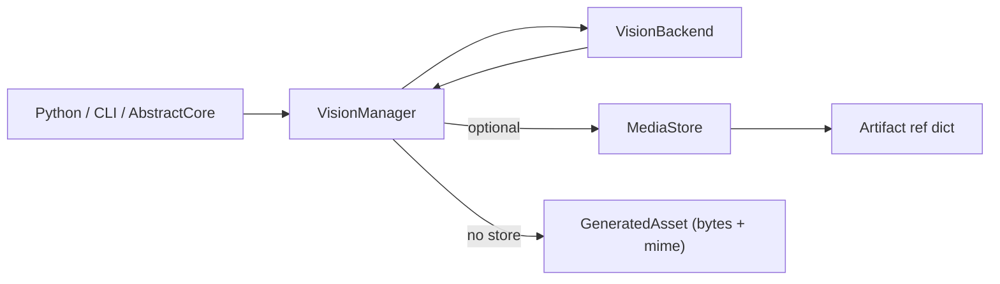

# AbstractVision

[](https://pypi.org/project/abstractvision/)
[](https://github.com/lpalbou/AbstractVision/actions/workflows/ci.yml)
[](https://github.com/lpalbou/AbstractVision/actions/workflows/ci.yml)
[](https://github.com/lpalbou/AbstractVision/blob/main/LICENSE)
[](https://github.com/lpalbou/AbstractVision/stargazers)

Model-agnostic generative vision API (images, optional video) for Python and the Abstract* ecosystem.

## What you get

- A small orchestration API: [`VisionManager`](src/abstractvision/vision_manager.py)
- A packaged capability registry (“what models can do”): [`VisionModelCapabilitiesRegistry`](src/abstractvision/model_capabilities.py) backed by [`vision_model_capabilities.json`](src/abstractvision/assets/vision_model_capabilities.json)
- Optional artifact-ref outputs (small JSON refs): [`LocalAssetStore`](src/abstractvision/artifacts.py) and [`RuntimeArtifactStoreAdapter`](src/abstractvision/artifacts.py)
- Built-in backends (execution engines): [`src/abstractvision/backends/`](src/abstractvision/backends/)
  - OpenAI-compatible HTTP: [`openai_compatible.py`](src/abstractvision/backends/openai_compatible.py)
  - Local Diffusers: [`huggingface_diffusers.py`](src/abstractvision/backends/huggingface_diffusers.py)
  - Local stable-diffusion.cpp / GGUF: [`stable_diffusion_cpp.py`](src/abstractvision/backends/stable_diffusion_cpp.py)
- CLI/REPL for manual testing: [`abstractvision`](src/abstractvision/cli.py)
- Self-contained local Playground UI/API: [`playground/vision_playground.html`](playground/vision_playground.html) (docs: [`playground/README.md`](playground/README.md))

## How it fits together (diagram)



## Status (current backend support)

- Development status: **Alpha** (0.x). The public API is stable-by-design, but breaking changes may still happen and will be called out in `CHANGELOG.md`.
- Built-in backends implement: `text_to_image` and `image_to_image`.
- Video (`text_to_video`, `image_to_video`) is supported only via the OpenAI-compatible backend **when** endpoints are configured.
- `multi_view_image` is part of the public API (`VisionManager.generate_angles`) but no built-in backend implements it yet.

Details: [`docs/reference/backends.md`](docs/reference/backends.md).

## Installation

```bash
pip install abstractvision
```

The base install is lightweight. It includes the shared API, capability
registry, artifact helpers, CLI, AbstractCore plugin entry point, and the
stdlib OpenAI-compatible HTTP backend. Local inference runtimes are explicit
extras.

Optional extras:

| Extra | Use |
|---|---|
| `abstractvision[openai]` | Official OpenAI provider intent marker; no SDK dependency today. |
| `abstractvision[openai-compatible]` | Generic local/remote OpenAI-shaped endpoint intent marker; stdlib-only today. |
| `abstractvision[diffusers]` | Install Torch/Diffusers and related packages for local Diffusers generation. |
| `abstractvision[huggingface]` | Compatibility alias for callers that still request the historical Diffusers extra. |
| `abstractvision[sdcpp]` | Install `stable-diffusion-cpp-python` for the pip binding fallback. |
| `abstractvision[local]` | Convenience for both local backend dependency sets, including `diffusers` and `sdcpp`. |
| `abstractvision[all]` | All runtime backend dependencies, without contributor tooling. |
| `abstractvision[apple]` / `abstractvision[all-apple]` | Native macOS Python profile: Diffusers/Torch MPS plus stable-diffusion.cpp bindings. |
| `abstractvision[gpu]` | GPU Diffusers/Torch profile. Install a CUDA/ROCm-enabled PyTorch wheel when needed. |
| `abstractvision[all-gpu]` | Full GPU-relevant local vision profile: Diffusers plus stable-diffusion.cpp bindings. |
| `abstractvision[abstractcore]` | Compatibility marker only; AbstractCore is still supplied by the host application. |

Contributor-only extras:

| Extra | Use |
|---|---|
| `abstractvision[diffusers-dev]` / `abstractvision[huggingface-dev]` | Looser dependency pins for newer/unreleased Diffusers pipelines; install Diffusers `main` separately if needed. |
| `abstractvision[test]` | Local test dependencies. |
| `abstractvision[docs]` | Documentation build tooling. |
| `abstractvision[dev]` | Full contributor workflow: tests, docs, build, lint, formatting, and pre-commit. Do not use this as an application runtime profile. |

Note (CUDA): on Windows/Linux, `pip install "abstractvision[diffusers]"` may install a CPU-only PyTorch build. If you want to use an NVIDIA GPU, install a CUDA-enabled PyTorch build first (see <https://pytorch.org/get-started/locally/>) and verify `torch.cuda.is_available()` is `True`.

AbstractCore is not installed by AbstractVision. When an AbstractCore application
has AbstractVision installed in the same environment, AbstractCore can discover
the plugin entry point and use the integration modules lazily.

If you hit “missing pipeline class” errors for newer model families, see [`docs/getting-started.md`](docs/getting-started.md). In that case you may need Diffusers from source (`main`):

```bash
pip install -U "abstractvision[diffusers-dev]"
pip install -U "git+https://github.com/huggingface/diffusers@main"
```

For local development from a repo checkout:

```bash
pip install -e ".[dev]"
```

## Usage

Start here:
- Getting started: [`docs/getting-started.md`](docs/getting-started.md)
- FAQ: [`docs/faq.md`](docs/faq.md)
- API reference: [`docs/api.md`](docs/api.md)
- Architecture: [`docs/architecture.md`](docs/architecture.md)
- Docs index: [`docs/README.md`](docs/README.md)

### First local model (Diffusers / cross-platform)

Install the local runtime extra, pre-download the model outside the REPL, then
select the Diffusers backend explicitly:

```bash
pip install "abstractvision[diffusers]"
huggingface-cli download runwayml/stable-diffusion-v1-5
export ABSTRACTVISION_BACKEND=diffusers
export ABSTRACTVISION_MODEL_ID=runwayml/stable-diffusion-v1-5
export ABSTRACTVISION_DIFFUSERS_DEVICE=auto
abstractvision repl
```

For a fresh cache, you can also permit the REPL to download missing files:

```bash
ABSTRACTVISION_DIFFUSERS_ALLOW_DOWNLOAD=1 abstractvision repl
```

More recommendations by VRAM: [`docs/getting-started.md`](docs/getting-started.md).

### Capability-driven model selection

```python
from abstractvision import VisionModelCapabilitiesRegistry

reg = VisionModelCapabilitiesRegistry()
assert reg.supports("runwayml/stable-diffusion-v1-5", "text_to_image")

print(reg.list_tasks())
print(reg.models_for_task("text_to_image"))
```

### Backend wiring + generation (artifact outputs)

The base install is import-light and does not install Torch/Diffusers. Heavy
local backend modules are imported lazily (see [`src/abstractvision/backends/__init__.py`](src/abstractvision/backends/__init__.py)).
Install `abstractvision[diffusers]` for local Diffusers, or
`abstractvision[sdcpp]` for the optional stable-diffusion.cpp python binding
fallback.

```python
from abstractvision import LocalAssetStore, VisionManager, VisionModelCapabilitiesRegistry, is_artifact_ref
from abstractvision.backends import OpenAICompatibleBackendConfig, OpenAICompatibleVisionBackend

reg = VisionModelCapabilitiesRegistry()

backend = OpenAICompatibleVisionBackend(
    config=OpenAICompatibleBackendConfig(
        base_url="http://localhost:1234/v1",
        api_key="YOUR_KEY",      # optional for local servers
        model_id="REMOTE_MODEL", # optional (server-dependent)
    )
)

vm = VisionManager(
    backend=backend,
    store=LocalAssetStore(),         # enables artifact-ref outputs
    model_id="zai-org/GLM-Image",    # optional: capability gating
    registry=reg,                   # optional: reuse loaded registry
)

out = vm.generate_image("a cinematic photo of a red fox in snow")
assert is_artifact_ref(out)
print(out)  # {"$artifact": "...", "content_type": "...", ...}

png_bytes = vm.store.load_bytes(out["$artifact"])  # type: ignore[union-attr]
```

When installed next to AbstractCore, AbstractVision is also discovered as a
`llm.vision` capability plugin. The plugin defaults to the official OpenAI
image endpoint (`https://api.openai.com/v1`) and reads `OPENAI_API_KEY` (or
`ABSTRACTVISION_API_KEY`). Set `OPENAI_BASE_URL` only when you need to override
that OpenAI-compatible base for the official OpenAI profile. Set
`ABSTRACTVISION_BACKEND=openai-compatible` plus `ABSTRACTVISION_BASE_URL` for a
local or remote compatible `/v1` server. Set `ABSTRACTVISION_MODEL_ID`,
`OPENAI_IMAGE_MODEL_ID`, or `OPENAI_IMAGE_MODEL` when you need an explicit
image model (static default OpenAI model: `gpt-image-1`). AbstractVision does
not query provider `/models` catalogs to discover or select image models
automatically, but you can inspect them explicitly with
`abstractvision provider-models`, `VisionManager.list_provider_models(...)`,
or the AbstractCore plugin method `llm.vision.list_provider_models(...)`.
After inspection, set the model env var explicitly for newer provider models
when available to your account. Set
`ABSTRACTVISION_BACKEND=diffusers` or `ABSTRACTVISION_BACKEND=sdcpp` when you
want AbstractCore to launch local AbstractVision generation directly.

### Interactive testing (CLI / REPL)

```bash
abstractvision models
abstractvision provider-models --openai --task text_to_image
abstractvision provider-models --base-url http://localhost:1234/v1 --task text_to_image
abstractvision tasks
abstractvision show-model runwayml/stable-diffusion-v1-5

abstractvision repl
```

Inside the REPL:

```text
/t2i "a watercolor painting of a lighthouse" --width 512 --height 512 --steps 10 --open
```

For a newer but still relatively small local model, try `black-forest-labs/FLUX.2-klein-4B` after installing Diffusers
from source (see [`docs/getting-started.md`](docs/getting-started.md)):

```text
/backend diffusers black-forest-labs/FLUX.2-klein-4B mps float16
/t2i "a product photo of a matte black espresso machine" --steps 4 --guidance-scale 1.0 --open
```

OpenAI-compatible server example:

```text
/backend openai http://localhost:1234/v1
/t2i "a watercolor painting of a lighthouse" --width 512 --height 512 --steps 10 --open
```

The CLI/REPL can also be configured via `ABSTRACTVISION_*` env vars; see [`docs/reference/configuration.md`](docs/reference/configuration.md).

### Local web playground

The playground is owned by AbstractVision and runs without AbstractCore. It is
a local/dev testing surface; use AbstractCore/Gateway for production routing,
authentication, and browser-origin policy.

```bash
abstractvision playground --port 8091
```

Open `http://127.0.0.1:8091/vision_playground.html`, select a cached model, then load it. The page and the API are served by the same process.

One-shot commands (OpenAI-compatible HTTP backend only):

```bash
abstractvision t2i --base-url http://localhost:1234/v1 "a studio photo of an espresso machine"
abstractvision i2i --base-url http://localhost:1234/v1 --image ./input.png "make it watercolor"
```

#### Local GGUF via stable-diffusion.cpp

If you want to run GGUF diffusion models locally, use the stable-diffusion.cpp backend (`sdcpp`). Start with a
single-file Stable Diffusion model when possible; Qwen Image and FLUX GGUF component sets are heavier.

Recommended:
- **macOS (Apple Silicon / Metal)**: install `sd-cli` (stable-diffusion.cpp executable) from releases and use CLI mode for Metal acceleration.
- Otherwise (pip-only convenience): `pip install "abstractvision[sdcpp]"` installs the stable-diffusion.cpp python bindings (`stable-diffusion-cpp-python`), but this may run CPU-only depending on the wheel build.

Alternative (external executable):

- Install `sd-cli`: <https://github.com/leejet/stable-diffusion.cpp/releases>

In the REPL:

```text
/backend sdcpp /path/to/sd-v1-5.gguf /path/to/sd-cli
/t2i "a watercolor painting of a lighthouse" --width 512 --height 512 --steps 10 --open
```

FLUX.2-klein-4B GGUF component example:

```text
/backend sdcpp /path/to/flux-2-klein-4b-Q8_0.gguf /path/to/flux2_ae.safetensors /path/to/Qwen3-4B-Q4_K_M.gguf /path/to/sd-cli
/t2i "a product photo of a matte black espresso machine" --steps 4 --guidance-scale 1.0 --sampling-method euler --diffusion-fa --offload-to-cpu --open
```

Extra flags are forwarded via `request.extra`. In CLI mode they are forwarded to `sd-cli`; in python bindings mode, keys are mapped to python binding kwargs when supported and unsupported keys are ignored.

### AbstractCore tool integration (artifact refs)

If you’re using AbstractCore tool calling, AbstractVision can expose vision tasks as tools:

```python
from abstractvision.integrations.abstractcore import make_vision_tools

tools = make_vision_tools(vision_manager=vm, model_id="zai-org/GLM-Image")
```

Install `abstractcore` in the host application environment when you use these helpers; it is not pulled in by AbstractVision.

## AbstractFramework ecosystem

AbstractVision is part of the **AbstractFramework** ecosystem and is designed to compose with:

- **AbstractFramework** (project hub): <https://github.com/lpalbou/AbstractFramework>
- **AbstractCore** (orchestration + tool calling): <https://github.com/lpalbou/abstractcore>
- **AbstractRuntime** (runtime services, including artifact storage): <https://github.com/lpalbou/abstractruntime>

In practice:
- AbstractVision standardizes *generative vision outputs* (image/video) behind `VisionManager`.
- AbstractCore can discover and use AbstractVision via the capability plugin (`src/abstractvision/integrations/abstractcore_plugin.py`) or you can expose vision tasks as tools (`src/abstractvision/integrations/abstractcore.py`).
- Artifact refs returned by AbstractVision are designed to travel across processes; `RuntimeArtifactStoreAdapter` bridges to an AbstractRuntime-style artifact store (`src/abstractvision/artifacts.py`).

## Project

- Release notes: [`CHANGELOG.md`](CHANGELOG.md)
- Contributing: [`CONTRIBUTING.md`](CONTRIBUTING.md)
- Security: [`SECURITY.md`](SECURITY.md)
- Acknowledgments: [`ACKNOWLEDGMENTS.md`](ACKNOWLEDGMENTS.md)
- Agent docs: [`llms.txt`](llms.txt) and [`llms-full.txt`](llms-full.txt)

## Requirements

- Python >= 3.9

## License

MIT License - see LICENSE file for details.

## Author

Laurent-Philippe Albou

## Contact

contact@abstractcore.ai
