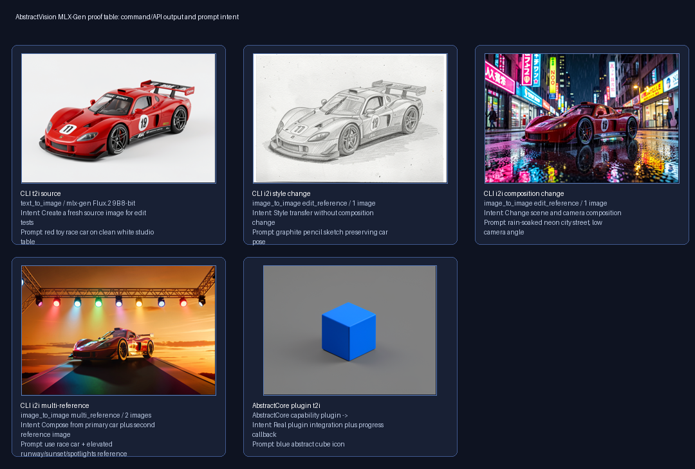
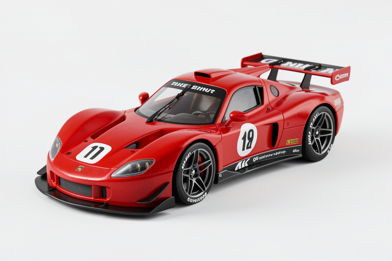
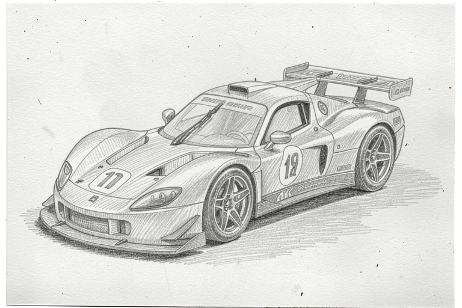
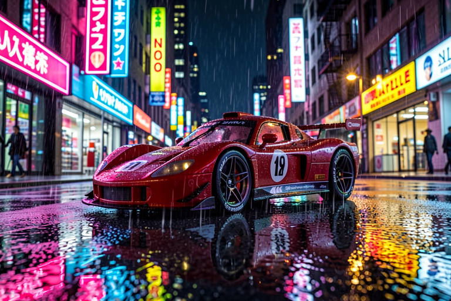
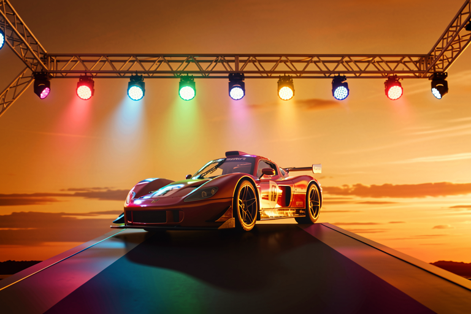
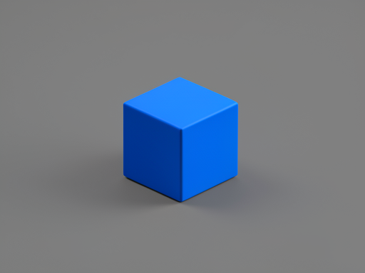
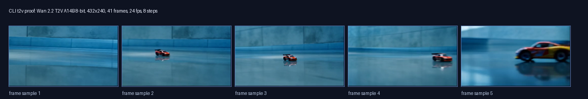

# MLX-Gen local examples

This page shows local MLX-Gen image, edit, multi-reference edit, AbstractCore
plugin, and Wan A14B video outputs generated through AbstractVision. The
examples use MLX-Gen `0.18.10` with cached or prepared model artifacts.

MLX-Gen progress follows denoise steps. For video, the CLI percentage is
`step / total_steps`; frame counts are displayed only as context.

## Setup

Install the MLX-Gen runtime extra and download the models used below:

```bash
pip install "abstractvision[mlx-gen]"

abstractvision download AbstractFramework/flux.2-klein-9b-8bit --provider mlx-gen
abstractvision download AbstractFramework/wan2.2-t2v-a14b-diffusers-8bit --provider mlx-gen
```

Choose an asset store and input path names for the examples:

```bash
STORE_DIR=./mlx-gen-local-examples-store
SOURCE_IMAGE=./race-car-source.png
REFERENCE_IMAGE=./multi-reference-scene.png
```

The multi-reference input image used for the gallery is available here:
[multi_reference_scene.png](assets/mlx-gen-local-examples/multi_reference_scene.png).

## Commands

Create a source image for edit tests:

```bash
abstractvision t2i \
  --provider mlx-gen \
  --model AbstractFramework/flux.2-klein-9b-8bit \
  --store-dir "$STORE_DIR" \
  --width 768 \
  --height 512 \
  --steps 12 \
  --seed 2401 \
  --progress \
  "red toy race car on clean white studio table"
```

Use the generated source image for a style-preserving edit:

```bash
abstractvision i2i \
  --provider mlx-gen \
  --model AbstractFramework/flux.2-klein-9b-8bit \
  --store-dir "$STORE_DIR" \
  --image "$SOURCE_IMAGE" \
  --width 768 \
  --height 512 \
  --steps 12 \
  --seed 2402 \
  --progress \
  "graphite pencil sketch preserving car pose"
```

Use the same source image for a stronger composition change:

```bash
abstractvision i2i \
  --provider mlx-gen \
  --model AbstractFramework/flux.2-klein-9b-8bit \
  --store-dir "$STORE_DIR" \
  --image "$SOURCE_IMAGE" \
  --width 768 \
  --height 512 \
  --steps 12 \
  --seed 2403 \
  --progress \
  "rain-soaked neon city street, low camera angle"
```

Use a second reference image for multi-reference composition:

```bash
abstractvision i2i \
  --provider mlx-gen \
  --model AbstractFramework/flux.2-klein-9b-8bit \
  --store-dir "$STORE_DIR" \
  --image "$SOURCE_IMAGE" \
  --reference-image "$REFERENCE_IMAGE" \
  --width 768 \
  --height 512 \
  --steps 12 \
  --seed 2404 \
  --progress \
  "use race car + elevated runway/sunset/spotlights reference"
```

Generate a low-cost Wan A14B video check at `432x240`, 41 frames, and 8
denoise steps:

```bash
abstractvision t2v \
  --provider mlx-gen \
  --model AbstractFramework/wan2.2-t2v-a14b-diffusers-8bit \
  --store-dir "$STORE_DIR" \
  --width 432 \
  --height 240 \
  --num-frames 41 \
  --fps 24 \
  --steps 8 \
  --guidance-scale 4.0 \
  --seed 2406 \
  --progress \
  "A small red toy race car rolls forward on a glossy studio floor, camera locked, soft reflections, smooth motion"
```

## Outputs

The generated gallery below is bundled with the docs. The complete manifest is
available as [summary.json](assets/mlx-gen-local-examples/summary.json), and
the AbstractCore plugin progress event capture is available as
[abstractcore_plugin_t2i_progress_events.json](assets/mlx-gen-local-examples/abstractcore_plugin_t2i_progress_events.json).



<table>
  <thead>
    <tr>
      <th>Output</th>
      <th>Prompt or intent</th>
      <th>Result</th>
    </tr>
  </thead>
  <tbody>
    <tr>
      <td>Text to image</td>
      <td><code>red toy race car on clean white studio table</code></td>
      <td></td>
    </tr>
    <tr>
      <td>Image edit, style</td>
      <td><code>graphite pencil sketch preserving car pose</code></td>
      <td></td>
    </tr>
    <tr>
      <td>Image edit, composition</td>
      <td><code>rain-soaked neon city street, low camera angle</code></td>
      <td></td>
    </tr>
    <tr>
      <td>Multi-reference edit</td>
      <td><code>use race car + elevated runway/sunset/spotlights reference</code></td>
      <td></td>
    </tr>
    <tr>
      <td>AbstractCore plugin T2I</td>
      <td><code>blue abstract cube icon</code> with <code>on_progress(event)</code> capture</td>
      <td></td>
    </tr>
  </tbody>
</table>

## Video output

The A14B example is the real generated MP4. The contact sheet shows sampled
frames for quick inspection in static contexts.

<video controls muted playsinline preload="metadata" style="max-width: 100%; border-radius: 8px;">
  <source src="assets/mlx-gen-local-examples/wan_a14b_t2v_432x240_race_car.mp4" type="video/mp4" />
</video>


