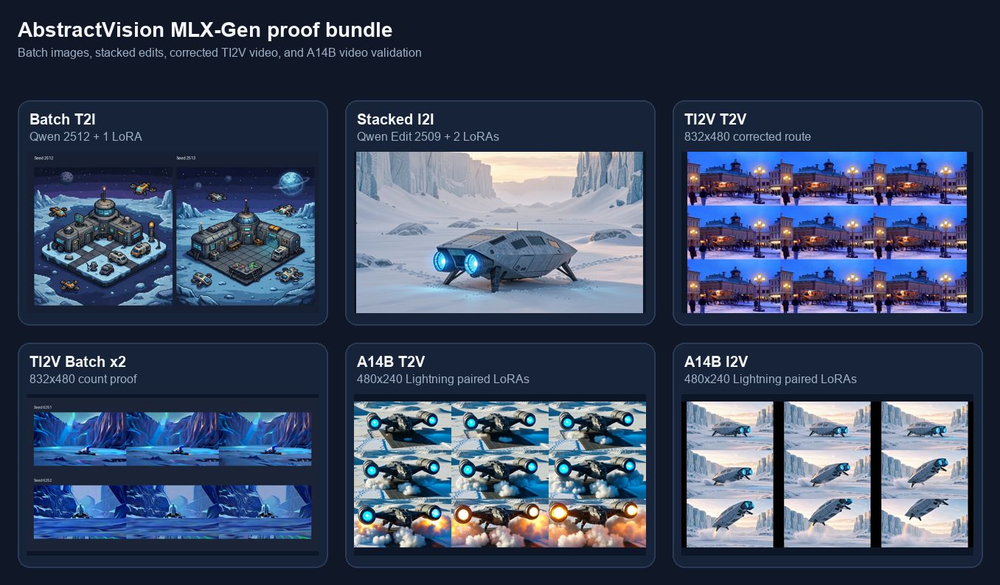
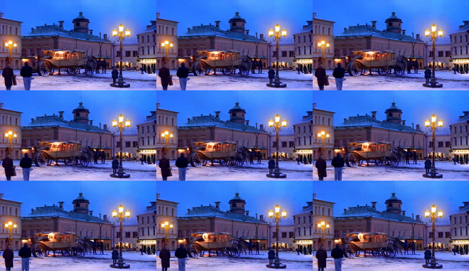
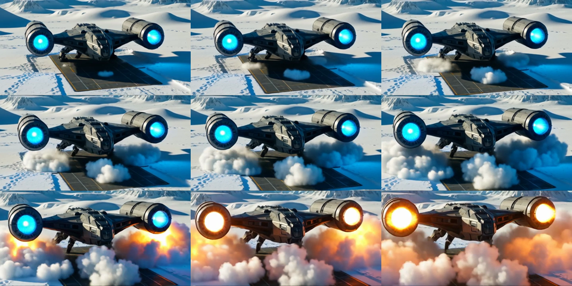
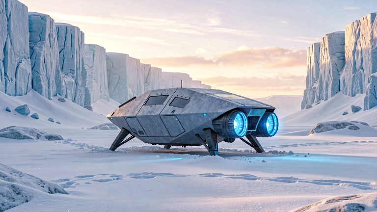
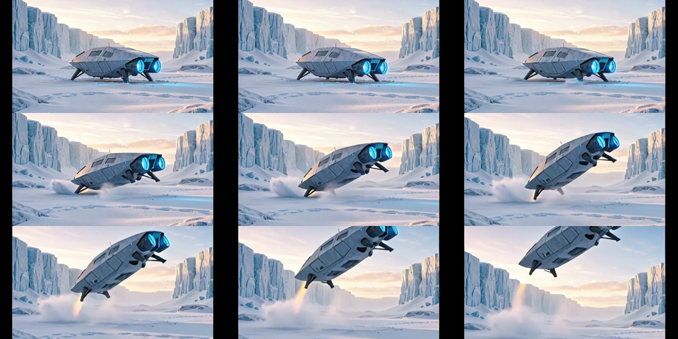

# MLX-Gen local examples

This page records the current bundled proof runs for the MLX-Gen backend in
AbstractVision.

All assets referenced here were generated through AbstractVision with
`mlx-gen 0.18.18` and copied into
[`docs/assets/mlx-gen-lora-examples/`](assets/mlx-gen-lora-examples/).

## What this page validates

- AbstractVision uses one shared LoRA adapter contract across
  `text_to_image`, `image_to_image`, `text_to_video`, and `image_to_video`:
  `LoRAAdapterSpec(...)` / `lora_adapters=[...]`.
- The same surface supports base runs, single-adapter runs, and stacked-adapter
  runs.
- AbstractVision exposes a simple public batch surface above the exact
  single-request dataclasses:
  `generate_image_batch(...)`, `edit_image_batch(...)`,
  `generate_video_batch(...)`, and `image_to_video_batch(...)`, plus CLI
  `--count` / `--seeds`.
- Provider-model discovery surfaces route truth through `supports_lora`,
  `lora_status`, `lora_target_roles`, and `lora_validation_profile`.
- Installed adapter discovery is backend-owned and lists optional overlays only;
  full-model component files are excluded from the adapter inventory.
- The public TI2V-5B visual proofs in this bundle use `832x480`.
- The public task-specific Wan A14B proofs in this bundle use `480x240`.
- The current AbstractVision MLX runtime floor is
  `mlx-gen>=0.18.18,<0.19.0`.

This package release is validated on Apple Silicon first. The MLX-Gen install
extra also exposes the upstream Linux/CUDA path when `mlx[cuda13]` markers
apply, but the proof assets on this page are Apple validations.

## Install and discovery

Install the MLX-Gen extra:

```bash
pip install "abstractvision[mlx-gen]"
```

Inspect the local MLX-Gen catalog before long runs:

```bash
abstractvision catalog --provider mlx-gen
abstractvision show-model AbstractFramework/qwen-image-edit-2509-8bit
abstractvision show-model AbstractFramework/wan2.2-ti2v-5b-diffusers-8bit
abstractvision show-model AbstractFramework/wan2.2-t2v-a14b-diffusers-8bit
abstractvision adapters --provider mlx-gen --model AbstractFramework/qwen-image-edit-2509-8bit --task image_to_image
abstractvision adapters --provider mlx-gen --model AbstractFramework/wan2.2-ti2v-5b-diffusers-8bit --task text_to_video
abstractvision adapters --provider mlx-gen --model AbstractFramework/wan2.2-i2v-a14b-diffusers-8bit --task image_to_video
```

Use `catalog` to browse downloadable models. Use `show-model` when you need
the exact runtime route contract, including default parameters such as
`flow_shift`. Use `adapters` when you need locally cached overlays that match
one route.

Bundled discovery artifacts:

- [provider_adapters_qwen2512_t2i.json](assets/mlx-gen-lora-examples/provider_adapters_qwen2512_t2i.json)
- [provider_adapters_qwen2509_i2i.json](assets/mlx-gen-lora-examples/provider_adapters_qwen2509_i2i.json)
- [provider_adapters_wan_ti2v_t2v.json](assets/mlx-gen-lora-examples/provider_adapters_wan_ti2v_t2v.json)
- [provider_adapters_wan_a14b_t2v.json](assets/mlx-gen-lora-examples/provider_adapters_wan_a14b_t2v.json)
- [provider_adapters_wan_a14b_i2v.json](assets/mlx-gen-lora-examples/provider_adapters_wan_a14b_i2v.json)
- [show_model_wan_ti2v_5b.txt](assets/mlx-gen-lora-examples/show_model_wan_ti2v_5b.txt)
- [show_model_wan_a14b_t2v.txt](assets/mlx-gen-lora-examples/show_model_wan_a14b_t2v.txt)
- [summary.json](assets/mlx-gen-lora-examples/summary.json)

## Shared adapter contract

In Python, use the typed request surface:

```python
from abstractvision import LoRAAdapterSpec, VisionManager
from abstractvision.backends import MLXGenBackendConfig, MLXGenVisionBackend

backend = MLXGenVisionBackend(
    config=MLXGenBackendConfig(model="AbstractFramework/qwen-image-2512-8bit")
)
t2i = VisionManager(backend=backend, model_id="AbstractFramework/qwen-image-2512-8bit")
assets = t2i.generate_image_batch(
    "Pixel art isometric research outpost on an icy exoplanet at blue hour",
    count=2,
    seeds=[2512, 2513],
    width=768,
    height=768,
    steps=20,
    guidance_scale=5.0,
    lora_adapters=[
        LoRAAdapterSpec(
            source="prithivMLmods/Qwen-Image-2512-Pixel-Art-LoRA:Qwen-Image-2512-Master-Pixel-Art-LoRA.safetensors",
            scale=1.0,
        )
    ],
)

edit_backend = MLXGenVisionBackend(
    config=MLXGenBackendConfig(model="AbstractFramework/qwen-image-edit-2509-8bit")
)
i2i = VisionManager(backend=edit_backend, model_id="AbstractFramework/qwen-image-edit-2509-8bit")
edited = i2i.edit_image(
    "Re-render the same vehicle from behind and slightly above.",
    image=open("./input.png", "rb").read(),
    steps=8,
    guidance_scale=1.0,
    lora_adapters=[
        LoRAAdapterSpec(
            source="lightx2v/Qwen-Image-Lightning:Qwen-Image-Edit-2509/Qwen-Image-Edit-2509-Lightning-8steps-V1.0-bf16.safetensors",
            scale=1.0,
        ),
        LoRAAdapterSpec(
            source="dx8152/Qwen-Edit-2509-Multiple-angles:镜头转换.safetensors",
            scale=0.9,
        ),
    ],
)
```

In the CLI, the equivalent surface is repeated `--lora*` flags. Passing no
LoRA flags keeps the base-model route. Passing one or more adapter flags stacks
them in order.

## Proof bundle

The proof manifest for the runs below is
[summary.json](assets/mlx-gen-lora-examples/summary.json).



| Proof | Model | Feature exercised | Output |
| --- | --- | --- | --- |
| Batch T2I x2 | `AbstractFramework/qwen-image-2512-8bit` | `--count 2`, explicit seeds, one LoRA | [contact sheet](assets/mlx-gen-lora-examples/t2i_qwen2512_pixel_art_batch_contact_sheet.png) |
| Stacked I2I | `AbstractFramework/qwen-image-edit-2509-8bit` | two LoRAs stacked on one edit run | [input](assets/mlx-gen-lora-examples/i2i_qwen2509_stacked_loras_input.png) / [PNG](assets/mlx-gen-lora-examples/i2i_qwen2509_stacked_loras.png) |
| TI2V visual proof | `AbstractFramework/wan2.2-ti2v-5b-diffusers-8bit` | validated `832x480` TI2V LoRA route | [MP4](assets/mlx-gen-lora-examples/t2v_wan_ti2v5b_hstoric_832x480.mp4) / [contact sheet](assets/mlx-gen-lora-examples/t2v_wan_ti2v5b_hstoric_832x480_contact_sheet.png) |
| Batch T2V x2 | `AbstractFramework/wan2.2-ti2v-5b-diffusers-8bit` | `--count 2`, explicit seeds, zero LoRAs | [contact sheet](assets/mlx-gen-lora-examples/t2v_batch_wan_ti2v5b_832x480_contact_sheet.png) |
| A14B T2V | `AbstractFramework/wan2.2-t2v-a14b-diffusers-8bit` | task-specific route, paired Lightning LoRAs | [MP4](assets/mlx-gen-lora-examples/t2v_wan_a14b_lightning_480x240.mp4) / [contact sheet](assets/mlx-gen-lora-examples/t2v_wan_a14b_lightning_480x240_contact_sheet.png) |
| A14B I2V | `AbstractFramework/wan2.2-i2v-a14b-diffusers-8bit` | task-specific route, paired Lightning LoRAs | [input](assets/mlx-gen-lora-examples/i2v_wan_a14b_lightning_480x240_input.png) / [MP4](assets/mlx-gen-lora-examples/i2v_wan_a14b_lightning_480x240.mp4) |

The public first-frame `image_to_video` proof in this bundle now uses the
task-specific Wan A14B route. TI2V-5B `image_to_video` remains supported
through the same runtime surface, but the bundle keeps only the validated
public proofs that held up visually at the supported sizes.

## Exact commands used

### Batch text to image: Qwen Image 2512 + pixel-art LoRA

```bash
PYTHONPATH=src python -m abstractvision.cli t2i \
  --provider mlx-gen \
  --model AbstractFramework/qwen-image-2512-8bit \
  --store-dir <store> \
  --width 768 \
  --height 768 \
  --steps 20 \
  --guidance-scale 5.0 \
  --count 2 \
  --seeds 2512,2513 \
  --lora prithivMLmods/Qwen-Image-2512-Pixel-Art-LoRA:Qwen-Image-2512-Master-Pixel-Art-LoRA.safetensors \
  --lora-scale 1.0 \
  --progress \
  "Pixel art isometric research outpost on an icy exoplanet at blue hour, tiny service drones, crisp tiles, retro RPG palette"
```

Outputs:

- [seed 2512](assets/mlx-gen-lora-examples/t2i_qwen2512_pixel_art_batch_seed2512.png)
- [seed 2513](assets/mlx-gen-lora-examples/t2i_qwen2512_pixel_art_batch_seed2513.png)
- [progress log](assets/mlx-gen-lora-examples/t2i_batch_qwen2512_pixel_art.progress.log)

### Image to image: Qwen Image Edit 2509 + stacked LoRAs

```bash
PYTHONPATH=src python -m abstractvision.cli i2i \
  --provider mlx-gen \
  --model AbstractFramework/qwen-image-edit-2509-8bit \
  --store-dir <store> \
  --image ./input.png \
  --steps 8 \
  --guidance-scale 1.0 \
  --seed 9701 \
  --lora lightx2v/Qwen-Image-Lightning:Qwen-Image-Edit-2509/Qwen-Image-Edit-2509-Lightning-8steps-V1.0-bf16.safetensors \
  --lora dx8152/Qwen-Edit-2509-Multiple-angles:镜头转换.safetensors \
  --lora-scale 1.0 \
  --lora-scale 0.9 \
  --progress \
  "Use the source starfighter as the same object. Re-render it from behind and slightly above, banking left over the snowy canyon, keeping the same vehicle identity and environment."
```

Artifacts:

- [input image](assets/mlx-gen-lora-examples/i2i_qwen2509_stacked_loras_input.png)
- [edited image](assets/mlx-gen-lora-examples/i2i_qwen2509_stacked_loras.png)
- [metadata](assets/mlx-gen-lora-examples/i2i_qwen2509_stacked_loras.meta.json)
- [progress log](assets/mlx-gen-lora-examples/i2i_qwen2509_stacked_loras.progress.log)

### Text to video: TI2V-5B + HSToric LoRA at 832x480

```bash
HF_HUB_OFFLINE=1 PYTHONPATH=src python -m abstractvision.cli t2v \
  --provider mlx-gen \
  --model AbstractFramework/wan2.2-ti2v-5b-diffusers-8bit \
  --store-dir <store> \
  --width 832 \
  --height 480 \
  --frames 17 \
  --steps 20 \
  --guidance-scale 4.0 \
  --flow-shift 3.0 \
  --fps 16 \
  --seed 6301 \
  --lora AlekseyCalvin/HSToric_Color_Wan2.2_5B_LoRA_BySilverAgePoets:HSToric_color_Wan22_5b_LoRA.safetensors \
  --lora-target-role transformer \
  --lora-scale 0.8 \
  --progress \
  "HST style HD film, early 1900s, autochrome, analog cinema. A horse-drawn carriage crossing a snowy town square at dusk, pedestrians in wool coats, historical street lamps glowing, gentle cinematic motion."
```

<video controls muted playsinline preload="metadata" style="max-width: 100%; border-radius: 8px;">
  <source src="assets/mlx-gen-lora-examples/t2v_wan_ti2v5b_hstoric_832x480.mp4" type="video/mp4" />
</video>



Progress proof:
[t2v_wan_ti2v5b_hstoric_832x480.progress.log](assets/mlx-gen-lora-examples/t2v_wan_ti2v5b_hstoric_832x480.progress.log)

### Batch text to video: TI2V-5B x2

```bash
HF_HUB_OFFLINE=1 PYTHONPATH=src python -m abstractvision.cli t2v \
  --provider mlx-gen \
  --model AbstractFramework/wan2.2-ti2v-5b-diffusers-8bit \
  --store-dir <store> \
  --width 832 \
  --height 480 \
  --frames 9 \
  --steps 8 \
  --guidance-scale 4.0 \
  --flow-shift 3.0 \
  --fps 8 \
  --count 2 \
  --seeds 6251,6252 \
  --progress \
  "A compact silver spaceship rests in a frozen canyon at dawn. Blue engines begin to glow, loose snow drifts across the landing pad, and the camera holds a stable wide composition with gentle atmospheric motion."
```

Artifacts:

- [seed 6251 MP4](assets/mlx-gen-lora-examples/t2v_batch_wan_ti2v5b_832x480_seed6251.mp4)
- [seed 6252 MP4](assets/mlx-gen-lora-examples/t2v_batch_wan_ti2v5b_832x480_seed6252.mp4)
- [contact sheet](assets/mlx-gen-lora-examples/t2v_batch_wan_ti2v5b_832x480_contact_sheet.png)
- [progress log](assets/mlx-gen-lora-examples/t2v_batch_wan_ti2v5b_832x480.progress.log)

### Text to video: task-specific Wan A14B + Lightning pair at 480x240

```bash
HF_HUB_OFFLINE=1 PYTHONPATH=src python -m abstractvision.cli t2v \
  --provider mlx-gen \
  --model AbstractFramework/wan2.2-t2v-a14b-diffusers-8bit \
  --store-dir <store> \
  --negative "oversaturated colors, overexposed, static shot, blurry details, subtitles, text, watermark, painting, illustration, ugly, deformed, broken anatomy, extra limbs, cluttered background, frozen frame, low quality, jpeg artifacts" \
  --width 480 \
  --height 240 \
  --frames 41 \
  --steps 4 \
  --guidance-scale 1 \
  --guidance-2 1 \
  --flow-shift 5 \
  --fps 20 \
  --seed 8401 \
  --lora lightx2v/Wan2.2-Lightning:Wan2.2-T2V-A14B-4steps-lora-rank64-Seko-V1.1/high_noise_model.safetensors \
  --lora lightx2v/Wan2.2-Lightning:Wan2.2-T2V-A14B-4steps-lora-rank64-Seko-V1.1/low_noise_model.safetensors \
  --lora-target-role high_noise_transformer \
  --lora-target-role low_noise_transformer \
  --lora-scale 1 \
  --lora-scale 1 \
  --progress \
  "A cinematic wide-angle movie shot of a massive futuristic starship taking off from a frozen tundra. The ship features sleek dark metallic armor. Two massive warp nacelles pulse with bright blue plasma. Violent snow squalls whip around the hull. The camera slowly tilts up as the thrusters ignite and massive clouds of snow blast away from the launch pad. Photorealistic, highly detailed, dramatic lighting."
```

<video controls muted playsinline preload="metadata" style="max-width: 100%; border-radius: 8px;">
  <source src="assets/mlx-gen-lora-examples/t2v_wan_a14b_lightning_480x240.mp4" type="video/mp4" />
</video>



Progress proof:
[t2v_wan_a14b_lightning_480x240.progress.log](assets/mlx-gen-lora-examples/t2v_wan_a14b_lightning_480x240.progress.log)

### Image to video: task-specific Wan A14B + Lightning pair at 480x240

```bash
HF_HUB_OFFLINE=1 PYTHONPATH=src python -m abstractvision.cli i2v \
  --provider mlx-gen \
  --model AbstractFramework/wan2.2-i2v-a14b-diffusers-8bit \
  --store-dir <store> \
  --image ./input.png \
  --negative "oversaturated colors, overexposed, static shot, blurry details, subtitles, text, watermark, painting, illustration, ugly, deformed, broken anatomy, extra limbs, cluttered background, frozen frame, low quality, jpeg artifacts" \
  --width 480 \
  --height 240 \
  --frames 41 \
  --steps 4 \
  --guidance-scale 1 \
  --guidance-2 1 \
  --flow-shift 5 \
  --fps 20 \
  --seed 8402 \
  --lora lightx2v/Wan2.2-Lightning:Wan2.2-I2V-A14B-4steps-lora-rank64-Seko-V1/high_noise_model.safetensors \
  --lora lightx2v/Wan2.2-Lightning:Wan2.2-I2V-A14B-4steps-lora-rank64-Seko-V1/low_noise_model.safetensors \
  --lora-target-role high_noise_transformer \
  --lora-target-role low_noise_transformer \
  --lora-scale 1 \
  --lora-scale 1 \
  --progress \
  "Starting from the input image, the silver spaceship powers up and lifts off from the frozen ground. Blue engines brighten, snow blasts outward, vapor rolls under the hull, and the camera holds the same wide icy canyon framing while the ship rises smoothly."
```

Source image:



<video controls muted playsinline preload="metadata" style="max-width: 100%; border-radius: 8px;">
  <source src="assets/mlx-gen-lora-examples/i2v_wan_a14b_lightning_480x240.mp4" type="video/mp4" />
</video>



Progress proof:
[i2v_wan_a14b_lightning_480x240.progress.log](assets/mlx-gen-lora-examples/i2v_wan_a14b_lightning_480x240.progress.log)

## Progress semantics

The bundled logs show the normalized MLX-Gen semantics that AbstractVision
preserves:

- image generation and image edit report denoise-step progress (`0/20`,
  `1/20`, ..., `20/20`, `complete`);
- video generation reports denoise-step progress while keeping frame counts as
  context (`1/20 denoise frame 0/17`, ..., `20/20 decode`, `convert`,
  `generated`).

That is the progress contract AbstractVision forwards to Python callers, the
AbstractCore plugin, and higher-level runtime and gateway consumers.
